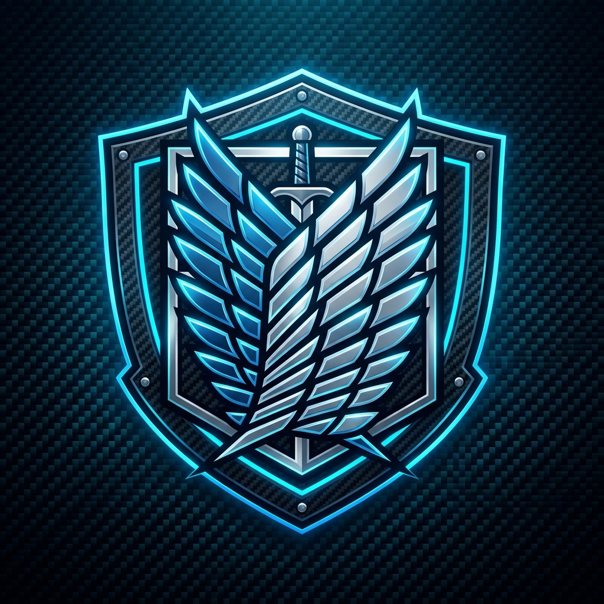

<div align="center">



# 🪽 AoT Game Discord Bot

**A full-featured Attack on Titan Discord game bot**  
Powered by [aot-toolkit](https://github.com/subhobhai943/aot-toolkit) • Built with Python & discord.py

[](https://www.python.org/)
[](https://discordpy.readthedocs.io/)
[](https://github.com/subhobhai943/aot-toolkit)
[](https://github.com/subhobhai943/discord-video-stream-py)
[](LICENSE)

</div>

---

## ✨ Features

| Feature | Description |
|---|---|
| ⚔️ **Turn-Based Combat** | Interactive button-driven battles against 9 titan opponents |
| 🎨 **Enhanced Battle Images** | Live scenes with detailed scout/titan silhouettes & ODM gear effects |
| 📊 **Player Profiles** | XP, levels, rank, win/loss stats rendered as image cards |
| 🧙 **Scout Selection** | Choose from 9 iconic AoT characters |
| 👹 **Titan Roster** | 9 titans with unique HP scaling and difficulty |
| 📖 **Lore Lookup** | Offline character, titan & quote database via aot-toolkit |
| 🪂 **ODM Gear Mini-Game** | Grapple and nape strike simulations |
| 🏆 **Rank System** | Cadet → Scout → Elite → Captain → Legend |
| 🎮 **Fun Games** | Trivia, Titan Spawn Simulator, ODM Training, Daily Challenges |
| ⚡ **Character Abilities** | Scout special powers & Titan Transformation Simulator |
| 🛠️ **Gear Upgrades** | Upgrade ODM blades, gas tanks, handles, and thrusters |
| 🧩 **Mikasa Mode** | Red scarf, protection, devotion, and Ackerman bond features |
| 🎵 **Music Player** | Stream audio from YouTube, Spotify names, or any URL |
| 📹 **Video Streaming** | Stream video directly into Discord voice channels via Go Live |

---

## 🎨 Battle Image System

Every `/fight` turn dynamically generates a **fresh battle image** using Pillow:

- 🪽 **Scout silhouette** with ODM cable grapple lines
- 👹 **Titan silhouette** with glowing red eyes and glow aura
- 🟩 **Live HP bars** that shift color: `Green → Yellow → Red`
- 🏙️ **City skyline background** with lit windows
- 🌌 **Dynamic sky gradient** changes with battle phase
- 🔢 **Round counter badge**, last action log, and name plates
- ✅ / ☠️ **Victory / Defeat overlay** effects at battle end

---

## 🤖 Slash Commands

### ⚔️ Battle Commands
| Command | Description |
|---|---|
| `/fight <titan>` | Start a turn-based battle with live image rendering |
| `/flee` | Flee from your active battle (counts as a loss) |
| `/simulate <character> <titan>` | Cinematic narrative-style battle simulation |

### 🧙 Player Commands
| Command | Description |
|---|---|
| `/profile` | View your profile card as a rendered image |
| `/choose_scout <character>` | Select your scout character for battles |

### 🧩 Mikasa Commands
| Command | Description |
|---|---|
| `/mikasa <action> [user]` | Mikasa actions: red_scarf, protect, devotion, etc. |
| `/ackerman_bond <user>` | Check your Ackerman-style bond with another user |
| `/mikasa_stats` | View Mikasa's combat statistics and profile |

### 🎮 Game Commands
| Command | Description |
|---|---|
| `/trivia` | Play an AoT trivia challenge with reactions |
| `/spawn_titan` | Simulate a random Titan spawn (Common to Legendary) |
| `/odm_training [difficulty]` | Test ODM skills with obstacle course |
| `/daily_challenge` | Get today's daily challenge for bonus XP |
| `/aot_fact` | Get a random Attack on Titan fact |

### ⚡ Ability Commands
| Command | Description |
|---|---|
| `/ability` | Use your scout's signature special ability |
| `/transform <titan>` | Transform into a Titan (simulation) |
| `/gear_upgrade` | View/upgrade ODM gear components |
| `/scout_ranking` | View top 10 Scouts on leaderboard |

### 📖 Lore Commands
| Command | Description |
|---|---|
| `/character <name>` | Look up an AoT character (fuzzy search supported) |
| `/titan <name>` | Look up a titan's stats and abilities |
| `/quote [tag]` | Get a random AoT quote (optional tag: motivational, dark, wisdom) |

### 🪂 ODM Commands
| Command | Description |
|---|---|
| `/odm_grapple <distance> [speed] [gas]` | Simulate an ODM gear grapple |
| `/odm_strike [armor_level] [abilities]` | Simulate a nape strike on a titan |

### 🤖 AI Assistant & AutoMod Commands
| Command | Prefix | Description |
|---|---|---|
| `/aimode <mode>` | `>aimode <mode>` | Change the AI assistant personality (captain, friendly, funny, anime) |
| `/resetmemory` | `>resetmemory` | Clear the AI's short-term conversation memory for this channel |
| `/tokens` | `>tokens` | View AI model details, context size, pricing, and token usage |
| `/purge [amount] [reason]` | `>purge [amount] [reason]` | Purge messages from this channel (automatically clears AI memory) |

### 🎵 Music Commands
| Command | Prefix | Description |
|---|---|---|
| `/play <query>` | `>p <query>` | Play a song from YouTube, Spotify name, or URL |
| `/playlyrics <query>` | `>playlyrics <query>` | Play a song and print its synced lyrics in real-time with context emojis |
| `/skip` | `>skip` | Skip the current song |
| `/pause` | `>pause` | Pause playback |
| `/resume` | `>resume` | Resume playback |
| `/stop` | `>stop` | Stop music and clear the queue |
| `/queue` | `>queue` | View the music queue |

### 📹 Video Streaming Commands
| Command | Prefix | Description |
|---|---|---|
| `/vplay <query>` | `>vplay <query>` | Stream a video into a voice channel via Go Live |
| `/vskip` | `>vskip` | Skip the current video |
| `/vpause` | `>vpause` | Pause the video stream |
| `/vresume` | `>vresume` | Resume the video stream |
| `/vstop` | `>vstop` | Stop the stream and disconnect |
| `/vqueue` | `>vqueue` / `>vq` | View the video queue |

> **Note:** Video streaming uses [discord-video-stream-py](https://github.com/subhobhai943/discord-video-stream-py) and requires the bot account to have Go Live permissions in the server. Streams at **720p · 30fps · H.264**.

---

## 📊 Battle Moves

| Move | Damage | Miss Chance |
|---|---|---|
| ⚔️ Slash | 40–70 | 10% |
| 🪂 ODM Dash | 25–55 | 5% |
| 💥 Thunder Spear | 60–100 | 20% |
| 🌀 Spiral Cut | 35–65 | 12% |
| 🧱 Titan Smash | 55–90 | 18% |
| 🛡️ Defend | Heals 20 HP | — |

The **Titan AI** counters with random moves each round: stomp, swipe, boulder throw, roar, and crystal hardening.

---

## 👹 Titan Roster

| Titan | HP | Difficulty |
|---|---|---|
| Founding Titan | 500 | 🔴 Legendary |
| Colossal Titan | 450 | 🔴 Legendary |
| War Hammer Titan | 400 | 🟠 Hard |
| Beast Titan | 380 | 🟠 Hard |
| Armored Titan | 360 | 🟠 Hard |
| Attack Titan | 320 | 🟡 Medium |
| Female Titan | 300 | 🟡 Medium |
| Jaw Titan | 260 | 🟢 Easy |
| Cart Titan | 240 | 🟢 Easy |

---

## 🧙 Scout Roster

Levi Ackerman • Mikasa Ackerman • Eren Yeager • Armin Arlert  
Hange Zoe • Erwin Smith • Reiner Braun • Annie Leonhart • Bertholdt Hoover

---

## 📆 Rank System

| Rank | Level Requirement |
|---|---|
| Cadet | Level 1–4 |
| Scout | Level 5–9 |
| Elite | Level 10–14 |
| Captain | Level 15–19 |
| Legend | Level 20+ |

Earn **+80 XP** on victory and **+20 XP** on defeat. Each level requires `level × 120 XP`.

---

## 📦 Installation

```bash
git clone https://github.com/subhobhai943/aot-game-discord-bot.git
cd aot-game-discord-bot
pip install -r requirements.txt
```

### Requirements

```
discord.py[voice]>=2.3.0
aot-toolkit
python-dotenv>=1.0.0
Pillow
aiohttp>=3.9.0
yt-dlp>=2026.6.9
PyNaCl>=1.5.0
spotipy>=2.23.0
syncedlyrics>=1.0.0
beautifulsoup4>=4.12.3
rapidfuzz>=3.6.2
```

---

## ⚙️ Setup

1. **Create a Discord bot** at [discord.com/developers](https://discord.com/developers/applications)
2. Enable **Message Content Intent** and **Server Members Intent**
3. Copy `.env.example` → `.env` and add your token:
   ```env
   DISCORD_TOKEN=your_bot_token_here
   ```
4. Run the bot:
   ```bash
   python bot.py
   ```

---

## 🧱 Project Structure

```
aot-game-discord-bot/
├── bot.py                  # Main entry point & cog loader
├── cogs/
│   ├── arena.py            # Turn-based battle system + button UI
│   ├── battle.py           # Narrative battle simulation
│   ├── abilities.py        # Scout abilities & titan transforms
│   ├── profile.py          # Player profile card generation
│   ├── lore.py             # Character / titan / quote lookup
│   ├── odm.py              # ODM gear mini-game
│   ├── games.py            # Trivia, spawn simulator, ODM training
│   ├── music.py            # Music player (YouTube / Spotify / URL)
│   ├── video.py            # Video streaming via Go Live
│   ├── mikasa.py           # Mikasa / Ackerman bond features
│   ├── afk.py              # AFK system
│   ├── automod.py          # Auto-moderation
│   ├── leaderboard.py      # Scout rankings
│   ├── pvp.py              # Player vs Player battles
│   ├── titan_game.py       # Full titan game mode
│   ├── titan_catch.py      # Titan catching mini-game
│   ├── among_titans.py     # Among Titans social deduction game
│   ├── activate_rumbling.py# The Rumbling event
│   ├── colors.py           # Role color commands
│   ├── lookup.py           # General lookup utilities
│   ├── settings.py         # Per-guild prefix settings
│   └── help.py             # Custom help system
├── utils/
│   ├── image_gen.py        # Pillow battle & profile image generator
│   ├── game_state.py       # Player data, battle sessions, move logic
│   └── gifs.py             # GIF fetching utilities
├── data/
│   └── player_data.json    # Auto-generated player save file
├── assets/                 # Static images and assets
├── requirements.txt
├── .env.example
└── .gitignore
```

---

## 📝 License

This project is **proprietary and closed-source**.  
All rights reserved © 2026 [Subhadip Sarkar](https://github.com/subhobhai943).  
See [LICENSE](LICENSE) for full terms. Unauthorized copying, distribution, or modification is strictly prohibited.
